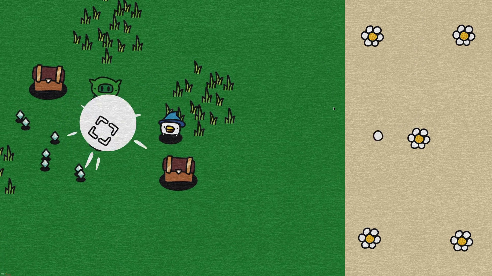

# Bouncing Survivors ⚪🌸

A hybrid **Survivor-like (Bullet Heaven) x Pinball / Bouncing Ball Metronome** action game built with HTML5 Canvas, TypeScript, and Vite.



---

## 🎯 The Concept

In traditional survivor-like games (e.g., *Vampire Survivors*), weapons fire on predictable cooldown timers or in fixed directions. 

**Bouncing Survivors introduces a physical metronome mechanic**:
The screen is split into two synchronized panes:
1. **The Left Arena (70% width)**: You control a wizard dodging waves of green demon pigs, agile crimson scouts, and heavily armored boar tanks. An automatic targeting bracket (`[ ]`) locks onto the closest onscreen threat or treasure chest.
2. **The Right Chamber (30% width)**: A vertical chamber with bouncing balls and **5 flower bumpers** arranged in a dice-pip pattern (4 corners, 1 center).

### ⚔️ Attack Triggers:
You have no manual attack buttons and no standard timers. **Attacks only fire when a ball bounces into a flower bumper**:
- **Corner Flower Bumpers**: Trigger precision slashes and rapid multi-strikes directly at your locked target.
- **Center Flower Bumper**: Triggers a massive white circular **Nova Shockwave** that obliterates surrounding hordes.
- **Bumper Hits**: Emits fluffy cloud puffs (`Poof!`), squashes elastically, and plays a harmonic chime note.

---

## ⚪ Special Ball Types

As you collect diamond XP gems and crack open wooden treasure chests, you unlock Spell Cards that grant unique balls with specialized behaviors:

* ⚪ **Standard Ball**: Balanced physical ball triggering classic slashes and Nova shockwaves.
* ⚡ **Lightning Orb**: Hyper-fast electric cyan ball with spark trails. Strikes trigger **Chain Lightning** that arcs across up to 4 onscreen enemies, shocking and micro-stunning them.
* 🔥 **Blazing Fireball**: Radiant fiery orb leaving floating flame embers. Strikes drop explosive **Meteors** that ignite **burning ground patches** for 3.5 seconds.
* 💣 **Heavy Cannonball**: Heavy metallic iron ball. Wall and bumper impacts trigger **Seismic Tremors** that shake the screen and stun all onscreen foes with dizzy stars.

---

## 🎮 Controls

* **Move**: `W` `A` `S` `D` or `Arrow Keys`
* **Mute / Unmute Sound**: 🔊 Icon in the top right

---

## 🚀 Quickstart & Development

Ensure [Node.js](https://nodejs.org/) is installed:

```bash
# Install dependencies
npm install

# Start local dev server (default: http://localhost:5173/)
npm run dev

# Build production bundle
npm run build
```

---

## 🛠️ Tech Stack

- **Rendering**: HTML5 Canvas 2D (high-performance 60 FPS loop, hand-drawn paper/canvas aesthetic, custom vector sprites).
- **Physics**: Circle-circle elastic collisions and boundary reflections.
- **Audio**: Procedural Web Audio API sound synthesizer (zero external sound asset dependencies).
- **Tooling**: TypeScript & Vite.
